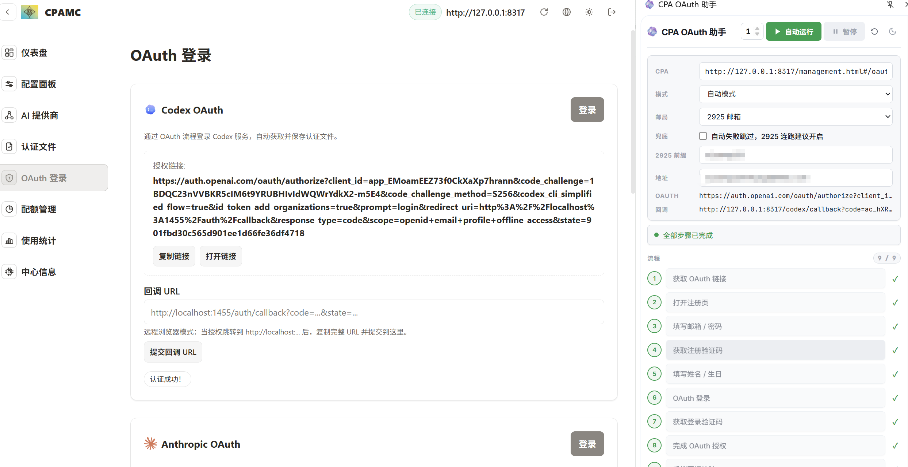
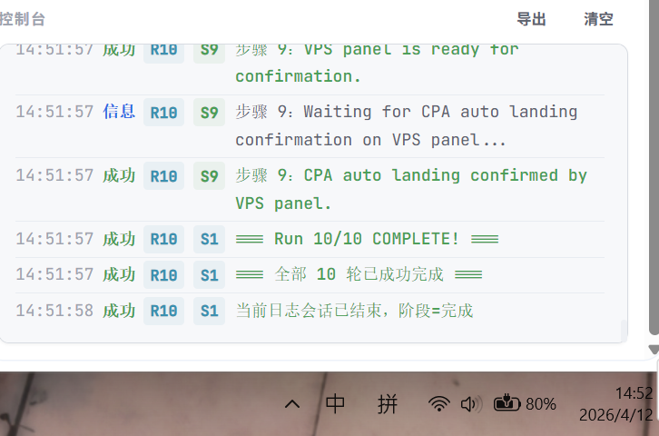

# SimpleAuthFlow

一个围绕 OpenAI OAuth 注册、登录与回调验证流程的 Chrome 扩展，当前版本为 `v3.0.1`。本版已经从单一邮箱流升级为多邮箱接入，并补齐了 `跳过步骤`、`兜底`、`继续当前 / 重新开始` 三项自动化辅助能力。

## 当前能力

- 支持 `Burner Mailbox / 2925 / QQ / 163` 四种邮箱 provider
- `2925` 模式会识别主邮箱并生成子邮箱，再在 2925 收件箱轮询验证码
- `QQ / 163` 模式会先去 Duck 生成 `@duck.com` 注册邮箱，再回到对应网页邮箱收码
- `Burner Mailbox` 保持兼容，继续支持自动生邮、人机验证暂停后继续、验证码轮询
- 支持 `自动模式` 与 `手动模式`
- 支持 `跳过步骤`、`Auto 启动时继续当前 / 重新开始`、`出错兜底补轮`
- 支持验证码等待超时后继续轮询、日志查看、日志导出、自定义密码
- `2925` 邮件列表遇到慢加载、空壳页或失败页时，会自动刷新重试后继续轮询
- 重发验证码成功后会自动切回邮箱页继续扫描，不再停留在授权页
- 侧边栏日志查看历史时不会再被新日志强制拉到底部

## 测试结果

<table>
  <tr>
    <td align="center" width="50%">
      
    </td>
    <td align="center" width="50%">
      
    </td>
  </tr>
</table>

## 赞赏支持

<table>
  <tr>
    <td align="center" width="50%">
      
      <br />
      微信
    </td>
    <td align="center" width="50%">
      
      <br />
      支付宝
    </td>
  </tr>
</table>

## 最近更新

### `v3.0.1` · `2026-04-12`

- 修复 `2925` 邮件列表失败页 / 慢加载场景下会过早报错的问题，改为自动刷新重试
- 修复重发验证码后缺少明确成功反馈且没有自动回到邮箱页的问题
- 修复日志查看历史时会被新日志强制拉到底部的问题

### `v3.0.0` · `2026-04-12`

- 新增 `2925 / Duck / QQ / 163` 多邮箱接入
- 保留 `Burner Mailbox` 兼容链路
- 新增 `跳过步骤`、`兜底`、`继续当前 / 重新开始`
- README 按真实素材与当前功能重写

完整历史见 [CHANGELOG.md](./CHANGELOG.md)。

## 多邮箱模式说明

### `Burner Mailbox`

- 自动邮箱来源：Burner Mailbox
- 自动收码来源：Burner Mailbox
- 兼容保留旧链路，支持人机验证暂停后继续

### `2925 模式`

- 自动邮箱来源：`2925 主邮箱 -> 子邮箱`
- 自动收码来源：2925 收件箱
- 使用前请先登录 `https://www.2925.com/#/mailList`
- 若遇到邮件列表失败提示、空壳页或慢加载，扩展会自动刷新并继续轮询

### `Duck + QQ 模式`

- 自动邮箱来源：Duck 设置页生成 `@duck.com`
- 自动收码来源：QQ 网页邮箱
- 使用前请先登录 Duck 与 QQ 邮箱网页

### `Duck + 163 模式`

- 自动邮箱来源：Duck 设置页生成 `@duck.com`
- 自动收码来源：163 网页邮箱
- 使用前请先登录 Duck 与 163 邮箱网页

## 环境要求

- Chromium 内核浏览器，例如 Chrome / Edge
- 可访问的 CPA OAuth 管理页
- 自动模式下提前登录目标邮箱站点
- `QQ / 163` 方案需要同时登录 Duck 设置页与对应网页邮箱
- 手动模式下自行准备邮箱，并在步骤 4 / 7 手动输入验证码

## 安装

1. 下载或克隆本仓库到本地
2. 打开 `chrome://extensions/`
3. 开启右上角“开发者模式”
4. 点击“加载已解压的扩展程序”
5. 选择当前仓库目录
6. 点击扩展图标打开 `SimpleAuthFlow` 侧边栏

## 侧边栏配置

### `VPS`

- 填写 CPA 的 OAuth 管理页地址
- 留空时默认使用 `http://127.0.0.1:8317/management.html#/oauth`

### `邮箱服务`

- `Burner Mailbox`
- `2925 邮箱`
- `QQ 邮箱`
- `163 邮箱`

自动模式下：

- `Burner Mailbox` 直接生成临时邮箱
- `2925` 自动识别主邮箱并生成子邮箱
- `QQ / 163` 自动生成 Duck 私有地址

手动模式下：

- provider 行隐藏
- 自动取邮箱按钮隐藏
- 只保留手动粘贴邮箱与手动输码

### `模式`

- `自动模式`：步骤 4 / 7 按当前 provider 自动取码
- `手动模式`：步骤 4 / 7 弹出验证码输入框，提交后自动继续

### `等待`

- 设置自动轮询验证码的等待时长
- 默认 `180` 秒
- 仅自动模式显示

### `兜底`

- 开启后，Auto 在单轮失败时不会直接结束总任务
- 当前线程会被放弃，并新开一轮去补足目标运行次数
- 已成功的轮次计数会保留
- 内置最大尝试上限，避免无限重试

### `邮箱`

- 可手动粘贴邮箱，也可以点击 `自动`
- `2925` 自动按钮返回子邮箱
- `QQ / 163` 自动按钮返回 Duck 私有地址

### `密码`

- 留空时自动生成随机密码
- 手动填写时使用你输入的密码

## 工作流

### 单步执行

- 适合排查单个步骤、修选择器、验证页面状态
- 步骤 1 到 9 都可以单独执行

### 跳过步骤

- 每一步右侧都有 `跳` 按钮
- 仅允许跳过当前可达步骤
- 上一步未完成时，不能跳过下一步
- Step 1 被跳过时，Step 2 会同步跳过，避免 OAuth 链接与注册页状态不一致

### 自动模式

- 点击顶部 `自动` 后可设置运行次数
- 如果检测到当前已有进度，会先弹出 `重新开始 / 继续当前 / 取消`
- `继续当前` 会从第一未完成步骤恢复
- `重新开始` 会清空本轮流程状态并从步骤 1 重开
- 遇到 Burner 人机验证、验证码超时或手动验证码输入时会暂停

## 详细步骤

### Step 1：获取 OAuth 链接

从 CPA 面板提取当前 OpenAI OAuth 授权链接并保存到侧边栏。

### Step 2：打开注册页

打开授权页并进入注册入口。

### Step 3：填写邮箱 / 密码

写入邮箱与密码，记录本轮账号信息。

### Step 4：获取注册验证码

- `Burner Mailbox`：从 Burner 页面轮询
- `2925`：按当前子邮箱在 2925 收件箱筛选
- `QQ / 163`：在网页邮箱中轮询 Duck 转发过来的验证码
- 手动模式：暂停并等待输入验证码
- 自动模式下重发验证码成功后，会自动切回邮箱页继续扫描

### Step 5：填写姓名 / 生日

自动生成姓名与生日并填写表单。

### Step 6：通过 OAuth 登录

复用授权页标签，使用步骤 3 的邮箱与密码继续登录。

### Step 7：获取登录验证码

收码路由与 Step 4 相同；手动模式下暂停等待输入。

### Step 8：OAuth 自动确认

自动处理授权确认页，并监听 localhost 回调或直接授权成功页。

### Step 9：VPS 验证

将回调地址写回 CPA 面板，完成最终验证。

## 项目结构

```text
SimpleAuthFlow-main/
├─ background.js
├─ manifest.json
├─ CHANGELOG.md
├─ shared/
│  ├─ mail-2925.js
│  └─ verification-timing.js
├─ content/
│  ├─ signup-page.js
│  ├─ burner-mail.js
│  ├─ duck-mail.js
│  ├─ 2925-mail.js
│  ├─ qq-mail.js
│  ├─ mail-163.js
│  ├─ vps-panel.js
│  └─ utils.js
├─ sidepanel/
│  ├─ sidepanel.html
│  ├─ sidepanel.css
│  └─ sidepanel.js
├─ tests/
│  ├─ localization.test.mjs
│  └─ provider-integration.test.mjs
└─ img/
```

## 已知限制

- `Duck` 在 `v3.0.0` 中只负责生成注册邮箱，不承担验证码收件
- 不包含 `Inbucket`
- `QQ / 163 / 2925` 默认要求你已提前登录网页邮箱或对应站点
- OpenAI、Duck、2925、QQ、163 页面结构变化后，选择器可能需要同步调整

## 调试建议

- 先看侧边栏日志区
- 再看扩展 Service Worker 控制台
- provider 页面异常时，查看对应内容脚本日志
- 首次切换到新 provider 时，建议先单步跑一遍再开多轮自动

## 致谢

- 基础思路来源于 [StepFlow-Duck](https://github.com/whwh1233/StepFlow-Duck)
- 多邮箱与自动化交互设计参考 `codex-oauth-automation-extension`
- 感谢“寸铁”在二次修改阶段提供的思路和贡献

## License

This project is licensed under the MIT License.
